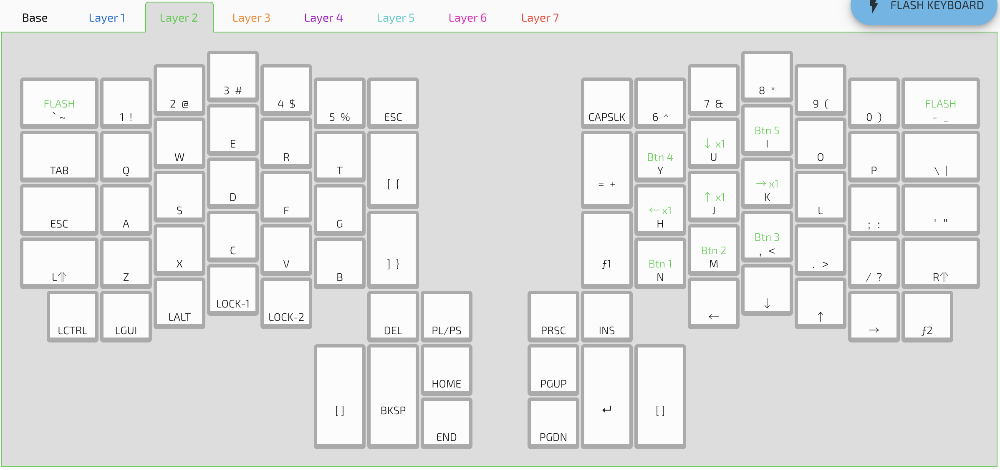

# Ergodox Infinity Kiibohd

Originally firmware is [kiibohd](https://kiibohd.github.io/wiki/#/Keyboards/InfinityErgodox)

## GUI Configuration
~~https://configurator.input.club/alpha/?layout=MDErgo1-Default~~

**Use the GUI from the kiibohd website**

The non-alpha version is currently broken. 10/23/2018

## Flashing
**Flash using hte GUI from the kiibohd website**
```
$ dfu-util -D left_kiibohd.dfu.bin
$ dfu-util -D right_kiibohd.dfu.bin
```

## Layout


